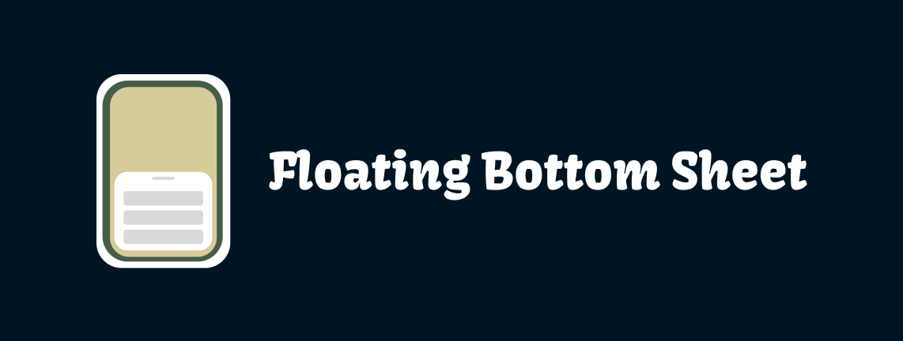
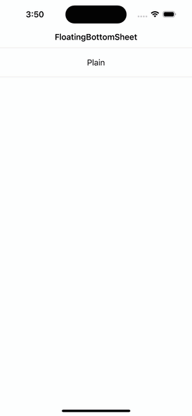

# FloatingBottomSheet



[](https://github.com/OhKanghoon/FloatingBottomSheet/actions?query=branch%3Amain+workflow%3ACI)
[](https://github.com/apple/swift-package-manager)
[](https://swiftpackageindex.com/OhKanghoon/FloatingBottomSheet)
[](https://swiftpackageindex.com/OhKanghoon/FloatingBottomSheet)

A library that displays floating bottom sheet.

See the [FloatingBottomSheet DocC documentation](https://swiftpackageindex.com/OhKanghoon/FloatingBottomSheet/main/documentation/floatingbottomsheet) hosted on the [Swift Package Index](https://swiftpackageindex.com/).

## Compatibility

FloatingBottomSheet requires **iOS 11+** and is compatible with **Swift 5** projects.

## Installation

### [Swift Package Manager](https://swift.org/package-manager).

The preferred way of installing FloatingBottomSheet is via the Swift Package Manager

1. In Xcode, open your project and navigate to **File** → **Add Packages**
2. Paste the repository URL (`https://github.com/OhKanghoon/FloatingBottomSheet`) and click **Next**.
3. For **Rules**, select **Up to Next Major Version**.
4. Click **Add Package**.


### [CocoaPods](https://guides.cocoapods.org/using/using-cocoapods.html)

```ruby
# Podfile
use_frameworks!

target 'YOUR_TARGET_NAME' do
  pod 'FloatingBottomSheet'
end
```

Replace `YOUR_TARGET_NAME` and then, in the `Podfile` directory, type:

```bash
$ pod install
```

## Usage



### Configuration

To use the FloatingBottomSheet, your ViewController must conform to the `FloatingBottomSheetPresentable` protocol.

Start by implementing the `bottomSheetScrollable` and `bottomSheetHeight` properties. 

```swift
final class ViewController: UIViewController, FloatingBottomSheetPresentable {
  
  var bottomSheetScrollable: UIScrollView? { 
    // Return a scrollable view
  }
    
  var bottomSheetHeight: CGFloat { 
    // Set the height of the bottom sheet
  }
}
```

### Present bottom sheet

Simply present the floating bottom sheet using the presentFloatingBottomSheet function like this:

```swift
let viewController = ViewController()

presentFloatingBottomSheet(viewController)
```

### Updates bottom sheet height at runtime

To update the bottom sheet's height dynamically during runtime, use the following code:

```swift
bottomSheetHeight = 400.0
bottomSheetPerformLayout(animated: true)
```

You can change the value of bottomSheetHeight to your desired height 
and then call `bottomSheetPerformLayout` function to update the bottom sheet's height with optional animation. 

If you don't want animation, set `animated` to false. 

## License

FloatingBottomSheet is under MIT license. See the [LICENSE](https://github.com/OhKanghoon/FloatingBottomSheet/blob/main/LICENSE) for more info.
